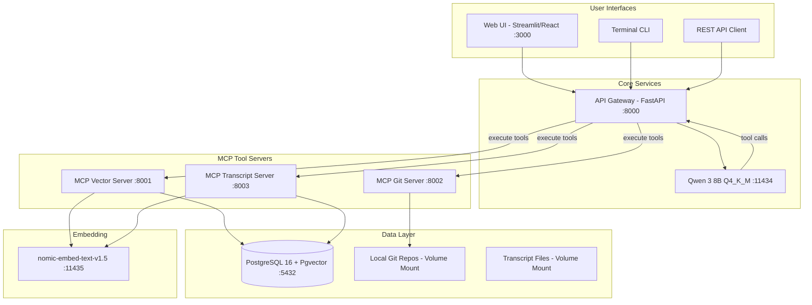

# Design: Cortex-Local

## Architecture Pattern

Cortex-Local follows a **modular MCP (Model Context Protocol) microservices architecture** where the LLM acts as an orchestrator that dynamically routes user queries to specialized tool servers via HTTP/REST. Each tool server is an independent container responsible for a single domain of retrieval.

## System Architecture



## Component Design

### 1. API Gateway (`gateway/`)

**Responsibility:** Central entry point for all user interactions. Manages the LLM orchestration loop (query → tool calls → synthesis → response).

**Key Design Decisions:**
- Single FastAPI service exposes `/query`, `/health`, `/sessions` endpoints
- Implements the MCP client role: discovers available tools from registered servers, formats them as function descriptions for the LLM
- Manages the tool-calling loop: LLM may request multiple tool calls in sequence before producing a final answer
- Maintains session state (conversation history) in-memory for v1 (Redis/DB-backed in future)
- Streams responses via SSE (Server-Sent Events) for real-time UI updates

**Interfaces:**
```
POST /query
  Request:  { "question": str, "session_id": str?, "source_filter": list[str]? }
  Response: { "answer": str, "citations": list[Citation], "tools_used": list[str] }

GET /query/stream
  Request:  { "question": str, "session_id": str? }
  Response: SSE stream of partial tokens + final citations

GET /health
  Response: { "status": "ok", "services": { "llm": bool, "vector": bool, "git": bool, "transcript": bool } }
```

**LLM Interaction Pattern:**
```python
# Pseudo-code for the orchestration loop
system_prompt = build_system_prompt(available_tools)
messages = [system_prompt] + session_history + [user_query]

while True:
    response = await llm.chat(messages)
    if response.has_tool_calls():
        results = await execute_tool_calls(response.tool_calls)
        messages.append(tool_results_message(results))
    else:
        return response.content  # Final answer
```

---

### 2. MCP Vector Server (`mcp-vector/`)

**Responsibility:** Semantic search over all ingested document embeddings stored in pgvector.

**Key Design Decisions:**
- Implements `VectorStore` abstraction interface for backend flexibility
- Connects to shared PostgreSQL instance for vector operations
- Calls embedding service to convert query text → vector before search
- Returns top-K results with similarity scores and full metadata

**Tools Exposed:**
```
search_documents(query: str, top_k: int = 5, source_filter: str? = None) -> list[SearchResult]
list_collections() -> list[Collection]
```

**VectorStore Abstraction:**
```python
class VectorStore(Protocol):
    async def store(self, chunks: list[DocumentChunk]) -> None: ...
    async def search(self, embedding: list[float], top_k: int, filters: dict?) -> list[SearchResult]: ...
    async def delete(self, source_id: str) -> None: ...
    async def list_collections(self) -> list[Collection]: ...

class PgvectorStore(VectorStore):
    # PostgreSQL + pgvector implementation
    ...
```

---

### 3. MCP Git Server (`mcp-git/`)

**Responsibility:** Real-time code search and file reading across indexed Git repositories.

**Key Design Decisions:**
- Operates on locally mounted git repos (volume-mounted into container)
- Provides grep-style search, file reading, and directory listing
- Does NOT use vector search — uses direct text search (ripgrep-style) for precision
- Returns results with file paths, line numbers, and surrounding context

**Tools Exposed:**
```
search_code(query: str, file_pattern: str? = None, repo: str? = None) -> list[CodeResult]
read_file(path: str, start_line: int? = None, end_line: int? = None) -> FileContent
list_files(path: str, pattern: str? = None) -> list[FileEntry]
```

---

### 4. MCP Transcript Server (`mcp-transcript/`)

**Responsibility:** Semantic search over video transcript content with timestamp-aware results.

**Key Design Decisions:**
- Uses pgvector for semantic search (transcript chunks are embedded during ingestion)
- Returns results with timestamp ranges for citation
- Supports fetching surrounding context (expand time window around a match)

**Tools Exposed:**
```
search_transcripts(query: str, top_k: int = 5) -> list[TranscriptResult]
get_transcript_segment(video_id: str, start_time: float, end_time: float) -> TranscriptSegment
```

---

### 5. Ingestion Service (`ingestion/`)

**Responsibility:** Processes raw content from multiple sources into chunked, embedded vectors stored in pgvector.

**Key Design Decisions:**
- Dual interface: FastAPI API + Typer CLI (both call the same core library)
- Pluggable source connectors: each source type implements a `SourceConnector` interface
- Chunking is configurable per source type (code uses AST-aware chunking, docs use heading-based, transcripts use time-window)
- Embedding is batched for efficiency (batch size configurable)
- Idempotent: re-ingesting the same source updates existing chunks rather than duplicating

**Source Connector Interface:**
```python
class SourceConnector(Protocol):
    source_type: str
    
    async def fetch(self, config: SourceConfig) -> AsyncIterator[RawDocument]: ...
    
class RawDocument:
    content: str
    metadata: dict  # source-specific metadata
    source_id: str  # unique identifier for deduplication
```

**Chunking Pipeline:**
```
RawDocument → Chunker (strategy per source) → list[DocumentChunk] → Embedder (batch) → VectorStore.store()
```

---

### 6. Web UI (`web-ui/`)

**Responsibility:** Browser-based chat interface for querying the knowledge base.

**Key Design Decisions:**
- Streamlit for v1 (fastest path to working UI, Python-native)
- React for v2 (if richer interactivity needed)
- Connects to gateway API via HTTP
- Displays streaming responses and formatted citations
- Source filter sidebar

---

### 7. Terminal CLI (`cli/`)

**Responsibility:** Interactive terminal chat client for developer-focused usage.

**Key Design Decisions:**
- Built with Typer + Rich for formatting
- REPL-style interactive loop
- Supports streaming display of LLM responses
- Special commands: `/sources`, `/clear`, `/quit`
- Also provides non-interactive mode for scripting: `cortex query "what is X"`

---

## Data Model

### PostgreSQL Schema

```sql
-- Enable pgvector
CREATE EXTENSION IF NOT EXISTS vector;

-- Document chunks with embeddings
CREATE TABLE document_chunks (
    id UUID PRIMARY KEY DEFAULT gen_random_uuid(),
    content TEXT NOT NULL,
    embedding vector(768) NOT NULL,
    
    -- Source metadata
    source_type VARCHAR(50) NOT NULL,  -- 'confluence', 'git', 'transcript'
    source_id VARCHAR(500) NOT NULL,   -- unique identifier for dedup
    source_url TEXT,
    
    -- Document metadata
    title VARCHAR(500),
    chunk_index INTEGER NOT NULL,
    total_chunks INTEGER,
    
    -- Source-specific metadata (JSON for flexibility)
    metadata JSONB DEFAULT '{}',
    
    -- Timestamps
    ingested_at TIMESTAMP WITH TIME ZONE DEFAULT NOW(),
    updated_at TIMESTAMP WITH TIME ZONE DEFAULT NOW(),
    
    -- Deduplication constraint
    UNIQUE(source_id, chunk_index)
);

-- Index for vector similarity search
CREATE INDEX idx_chunks_embedding ON document_chunks 
    USING ivfflat (embedding vector_cosine_ops) WITH (lists = 100);

-- Index for source filtering
CREATE INDEX idx_chunks_source_type ON document_chunks(source_type);
CREATE INDEX idx_chunks_source_id ON document_chunks(source_id);

-- Collections/sources tracking
CREATE TABLE ingestion_sources (
    id UUID PRIMARY KEY DEFAULT gen_random_uuid(),
    source_type VARCHAR(50) NOT NULL,
    name VARCHAR(500) NOT NULL,
    config JSONB DEFAULT '{}',
    last_ingested_at TIMESTAMP WITH TIME ZONE,
    chunk_count INTEGER DEFAULT 0,
    status VARCHAR(50) DEFAULT 'active',
    created_at TIMESTAMP WITH TIME ZONE DEFAULT NOW()
);
```

### Metadata Examples by Source Type

**Confluence:**
```json
{
  "space_key": "MS",
  "page_id": "12345",
  "labels": ["architecture", "design"],
  "last_modified": "2024-01-15T10:00:00Z",
  "author": "jsmith"
}
```

**Git:**
```json
{
  "repo_name": "cortex-local",
  "file_path": "gateway/src/main.py",
  "language": "python",
  "commit_hash": "abc123f",
  "line_start": 45,
  "line_end": 78
}
```

**Transcript:**
```json
{
  "video_title": "Q4 Release Demo",
  "timestamp_start": 154.5,
  "timestamp_end": 192.3,
  "source_file": "q4-release-demo.srt"
}
```

## Docker Compose Topology

```yaml
services:
  # Data Layer
  postgres:        # pgvector/pgvector:pg16, port 5432
  
  # Models (Docker Model Runner)
  qwen:            # docker.io/qwen3:8B-Q4_K_M, port 11434
  nomic-embed:     # nomic-embed-text-v1.5, port 11435
  
  # MCP Tool Servers
  mcp-vector:      # Custom, port 8001, depends: postgres, nomic-embed
  mcp-git:         # Custom, port 8002, volumes: git repos
  mcp-transcript:  # Custom, port 8003, depends: postgres, nomic-embed
  
  # Core Services
  gateway:         # Custom, port 8000, depends: qwen, mcp-*
  ingestion:       # Custom, port 8004, depends: postgres, nomic-embed
  
  # UI
  web-ui:          # Custom, port 3000, depends: gateway
```

**Container count:** 9 services total

## Networking

All services communicate over a single Docker bridge network (`cortex-net`). Service discovery uses Docker Compose DNS (service names as hostnames).

```
gateway → http://qwen:11434/v1/chat/completions
gateway → http://mcp-vector:8001/tools/search_documents
gateway → http://mcp-git:8002/tools/search_code
gateway → http://mcp-transcript:8003/tools/search_transcripts
mcp-vector → http://nomic-embed:11435/v1/embeddings
mcp-vector → postgresql://postgres:5432/cortex
```

## MCP Protocol Implementation

### Tool Registration

Each MCP server exposes a `/tools` discovery endpoint:

```json
GET /tools
{
  "tools": [
    {
      "name": "search_documents",
      "description": "Search indexed documents using semantic similarity",
      "inputSchema": {
        "type": "object",
        "properties": {
          "query": { "type": "string", "description": "Search query" },
          "top_k": { "type": "integer", "default": 5 }
        },
        "required": ["query"]
      }
    }
  ]
}
```

### Tool Execution

```json
POST /tools/search_documents
{
  "query": "how does donor matching work",
  "top_k": 3
}

Response:
{
  "results": [
    {
      "content": "Donor matching uses HLA typing to...",
      "score": 0.89,
      "metadata": { "source_type": "confluence", "title": "Matching Algorithm", "url": "..." }
    }
  ]
}
```

### Gateway → LLM Tool Description Format

The gateway translates MCP tool schemas into OpenAI-compatible function calling format for Qwen:

```json
{
  "tools": [
    {
      "type": "function",
      "function": {
        "name": "mcp_vector__search_documents",
        "description": "Search indexed documents using semantic similarity",
        "parameters": { ... }
      }
    }
  ]
}
```

## Error Handling Strategy

- **MCP server unavailable:** Gateway marks tool as unavailable, LLM works with remaining tools
- **LLM timeout:** Gateway returns partial results if tools have already been called
- **Embedding service down:** Vector and transcript servers return error; git server unaffected
- **PostgreSQL down:** Vector operations fail gracefully; git search still works
- **Malformed LLM response:** Gateway retries once with clarified prompt, then returns error to user

## Security Considerations (v1)

- No authentication for v1 (local-only deployment)
- No data leaves the Docker network
- Git repos mounted read-only
- Database credentials via environment variables (`.env` file, not committed)
- Future: Okta/OAuth2 for multi-user deployments
