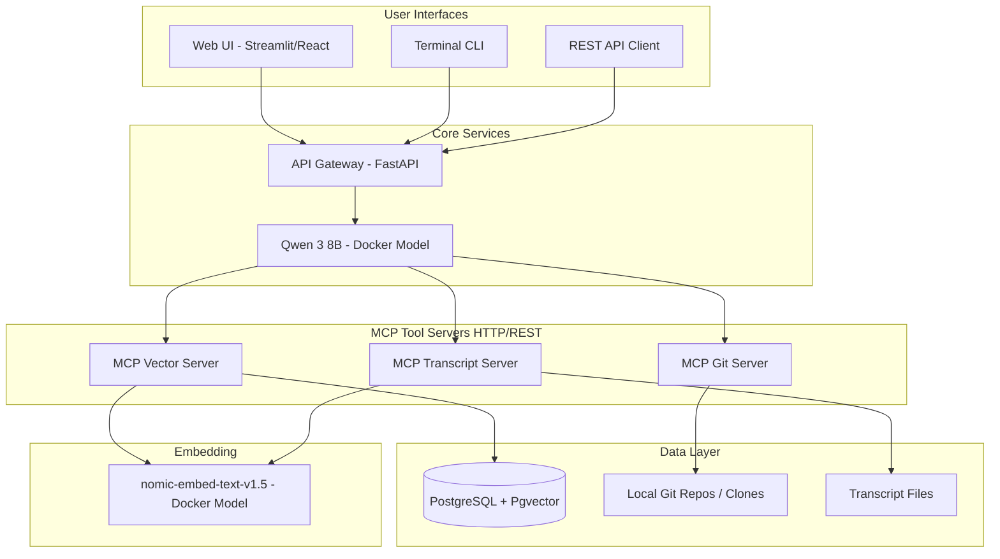
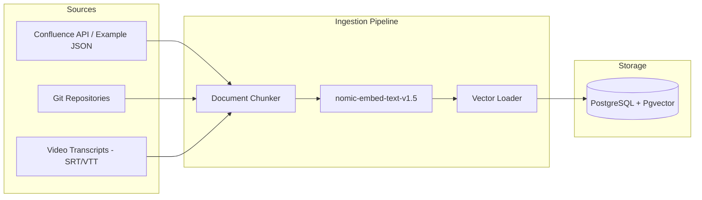

# Cortex-Local — Implementation Plan

## Problem Statement

Operational efficiency is hindered by manual effort to synthesize information across disparate sources (Confluence, code repos, video transcripts). Teams need a self-hosted, local-first RAG system that provides a unified AI-powered interface to query internal knowledge — without sending data to external cloud services.

## Requirements

1. Fully local execution — all inference, embedding, and storage runs on the user's machine via Docker
2. Multi-source ingestion — Confluence pages, Git repositories, video transcripts
3. MCP architecture — modular tool servers that the LLM orchestrates
4. Multiple query interfaces — REST API, web UI, terminal CLI
5. Ingestion via CLI and API
6. PostgreSQL + Pgvector as the vector store (with abstraction for future backends)
7. Example/mock data for initial development — real data integration deferred
8. Open-source under Apache 2.0 with open-core commercialization path

## Architecture

### System Overview



### Component Details

| Component | Technology | Docker Image | Port |
|-----------|-----------|--------------|------|
| LLM | Qwen 3 8B Q4_K_M | `docker.io/qwen3:8B-Q4_K_M` | 11434 |
| Embedding | nomic-embed-text-v1.5 | `nomic-embed-text-v1.5` | 11435 |
| Vector DB | PostgreSQL 16 + pgvector | `pgvector/pgvector:pg16` | 5432 |
| API Gateway | FastAPI | Custom build | 8000 |
| MCP Vector Server | FastAPI + mcp SDK | Custom build | 8001 |
| MCP Git Server | FastAPI + mcp SDK | Custom build | 8002 |
| MCP Transcript Server | FastAPI + mcp SDK | Custom build | 8003 |
| Web UI | Streamlit or React | Custom build | 3000 |

### MCP Protocol Flow

1. User submits query via any interface → hits API Gateway
2. Gateway forwards to Qwen LLM with system prompt listing available MCP tools
3. LLM decides which tool(s) to call based on query intent
4. LLM calls MCP server(s) via HTTP/REST
5. MCP servers retrieve context (vector search, git grep, transcript search)
6. Context returned to LLM for synthesis
7. LLM generates final response with source citations
8. Response returned to user with metadata

### Ingestion Flow



## Project Structure

```
cortex-local/
├── LICENSE                          # Apache 2.0
├── README.md
├── docker-compose.yml              # Full stack orchestration
├── .env.example                    # Environment variables template
├── docs/
│   ├── implementation-plan.md      # This file
│   ├── architecture.md
│   └── contributing.md
├── gateway/                        # API Gateway service
│   ├── Dockerfile
│   ├── pyproject.toml
│   ├── src/
│   │   ├── main.py                # FastAPI app
│   │   ├── llm_client.py         # Qwen interaction
│   │   ├── mcp_router.py         # Routes to MCP servers
│   │   └── models.py             # Pydantic schemas
│   └── tests/
├── mcp-vector/                    # MCP Vector Search Server
│   ├── Dockerfile
│   ├── pyproject.toml
│   ├── src/
│   │   ├── main.py               # FastAPI + MCP tool registration
│   │   ├── vector_store.py       # Pgvector abstraction
│   │   ├── embeddings.py         # nomic-embed-text client
│   │   └── models.py
│   └── tests/
├── mcp-git/                       # MCP Git Server
│   ├── Dockerfile
│   ├── pyproject.toml
│   ├── src/
│   │   ├── main.py
│   │   ├── git_tools.py          # Git search/read operations
│   │   └── models.py
│   └── tests/
├── mcp-transcript/                # MCP Transcript Server
│   ├── Dockerfile
│   ├── pyproject.toml
│   ├── src/
│   │   ├── main.py
│   │   ├── transcript_tools.py   # SRT/VTT parsing + search
│   │   └── models.py
│   └── tests/
├── ingestion/                     # Ingestion CLI + API
│   ├── Dockerfile
│   ├── pyproject.toml
│   ├── src/
│   │   ├── main.py               # FastAPI ingestion endpoints
│   │   ├── cli.py                # Click/Typer CLI
│   │   ├── chunker.py            # Document chunking strategies
│   │   ├── sources/
│   │   │   ├── confluence.py     # Confluence API connector
│   │   │   ├── git_repo.py       # Git repo file ingestion
│   │   │   └── transcript.py     # Video transcript ingestion
│   │   └── models.py
│   └── tests/
├── web-ui/                        # Web interface
│   ├── Dockerfile
│   ├── src/
│   └── ...
├── cli/                           # Terminal chat client
│   ├── pyproject.toml
│   └── src/
│       └── chat.py               # Interactive terminal chat
├── example-data/                  # Mock/example data for development
│   ├── confluence/               # Sample Confluence page JSON
│   ├── repos/                    # Small example git repo
│   └── transcripts/              # Sample SRT/VTT files
└── db/
    └── migrations/               # SQL migrations for pgvector schema
        └── 001_initial.sql
```

## Technology Stack

| Layer | Technology | Version |
|-------|-----------|---------|
| Language | Python | 3.12+ |
| Web Framework | FastAPI | 0.115+ |
| MCP SDK | `mcp` (Anthropic) | latest |
| CLI Framework | Typer | 0.12+ |
| LLM Runtime | Docker Model (Qwen 3 8B) | Q4_K_M |
| Embedding | nomic-embed-text-v1.5 | Docker model |
| Vector DB | PostgreSQL 16 + pgvector | 0.7+ |
| DB Client | asyncpg + pgvector | latest |
| Containerization | Docker + Docker Compose | v2 |
| Web UI | Streamlit (v1) or React (v2) | latest |
| Testing | pytest + pytest-asyncio | latest |
| Linting | ruff | latest |

## Task Breakdown

### Task 1: Project Scaffolding and Docker Compose Foundation

**Objective:** Set up the repository structure, Docker Compose stack with PostgreSQL + pgvector, and verify the database starts with vector extension enabled.

**Implementation guidance:**
- Initialize git repo with Apache 2.0 LICENSE, README, .gitignore
- Create `docker-compose.yml` with PostgreSQL 16 + pgvector service
- Create `db/migrations/001_initial.sql` with pgvector extension and initial schema (documents table with embedding column)
- Add healthcheck for PostgreSQL
- Create `.env.example` with all configuration variables

**Test requirements:**
- Docker Compose starts cleanly
- PostgreSQL accepts connections
- `CREATE EXTENSION vector` succeeds
- Initial migration runs successfully

**Demo:** `docker compose up -d postgres` starts a working pgvector database. Connect with psql and confirm vector extension is active.

---

### Task 2: Embedding Service Integration

**Objective:** Create a Python client that calls the local `nomic-embed-text-v1.5` Docker model to generate embeddings, and verify vectors are stored in pgvector.

**Implementation guidance:**
- Add `nomic-embed-text-v1.5` to Docker Compose as a model service
- Create `mcp-vector/src/embeddings.py` with an async client that sends text and receives 768-dim vectors
- Create a simple test script that embeds sample text and inserts into pgvector
- Define the `VectorStore` abstraction interface

**Test requirements:**
- Embedding model container starts and responds
- Sample text produces a 768-dimension vector
- Vector inserts into pgvector and can be retrieved
- Cosine similarity search returns expected results for known test data

**Demo:** Run a script that embeds "What is a donor search?" and stores it in pgvector. Query with a similar phrase and get the result back with similarity score.

---

### Task 3: MCP Vector Server

**Objective:** Build the first MCP tool server that exposes vector search as an HTTP/REST tool endpoint following the MCP protocol.

**Implementation guidance:**
- Create `mcp-vector/` FastAPI service with MCP tool registration
- Implement `search_documents` tool: accepts query string, embeds it, performs pgvector similarity search, returns ranked results with metadata
- Implement `list_collections` tool: returns available document collections
- Add to Docker Compose with proper networking
- Use Anthropic's `mcp` Python SDK for protocol compliance

**Test requirements:**
- MCP server starts and exposes tool discovery endpoint
- `search_documents` tool returns relevant results for test queries
- Results include source metadata (title, URL, chunk position)
- Server handles empty results gracefully

**Demo:** curl the MCP vector server's tool endpoint with a search query and receive ranked document chunks with metadata.

---

### Task 4: Ingestion Pipeline — Core Chunking and Storage

**Objective:** Build the document chunking engine and storage pipeline that processes raw text into embedded chunks stored in pgvector.

**Implementation guidance:**
- Create `ingestion/src/chunker.py` with configurable chunking (size, overlap, strategy)
- Support chunking strategies: fixed-size with overlap, paragraph-based, heading-based (for markdown/HTML)
- Create `ingestion/src/main.py` FastAPI app with `POST /ingest` endpoint
- Create `ingestion/src/cli.py` with Typer CLI wrapping the same core functions
- Store metadata per chunk: source_type, source_url, title, chunk_index, total_chunks, ingested_at

**Test requirements:**
- Chunker correctly splits documents by configured strategy
- Overlap produces expected repeated content between chunks
- Metadata is preserved through the pipeline
- CLI and API produce identical results for same input

**Demo:** Ingest a sample markdown file via CLI (`cortex ingest --source file --path ./example.md`) and via API. Verify chunks appear in pgvector with correct metadata.

---

### Task 5: Ingestion — Confluence Source Connector

**Objective:** Build the Confluence data source connector that fetches pages and feeds them into the chunking pipeline. Use example JSON data for development.

**Implementation guidance:**
- Create `ingestion/src/sources/confluence.py`
- Support two modes: live API (Confluence REST API with token auth) and file-based (load from example JSON)
- Create `example-data/confluence/` with 5-10 realistic sample pages (HTML content, titles, space keys, URLs)
- Parse Confluence HTML storage format into clean text
- Extract metadata: page title, space, URL, last modified, labels

**Test requirements:**
- Example JSON pages load and parse correctly
- HTML-to-text conversion preserves structure without tags
- Chunking + embedding pipeline works end-to-end with Confluence content
- CLI: `cortex ingest --source confluence --mode example`

**Demo:** Run ingestion against example Confluence data. Search for a term that appears in the example pages and get relevant results with Confluence page URLs as citations.

---

### Task 6: Ingestion — Git Repository Source Connector

**Objective:** Build the Git repository connector that indexes code files and documentation from local repos.

**Implementation guidance:**
- Create `ingestion/src/sources/git_repo.py`
- Clone or reference a local git repo path
- Index selectable file types (.py, .md, .yaml, .json, etc.) with configurable ignore patterns
- Create `example-data/repos/` with a small sample Python project (5-10 files)
- Store metadata: file path, repo name, language, last commit hash

**Test requirements:**
- Sample repo files are discovered and filtered correctly
- Code files are chunked appropriately (function/class level for Python, heading level for markdown)
- Binary files are skipped
- CLI: `cortex ingest --source git --path ./example-data/repos/sample-project`

**Demo:** Ingest the example repo. Search "how does authentication work" and get relevant code snippets with file paths as citations.

---

### Task 7: Ingestion — Video Transcript Source Connector

**Objective:** Build the video transcript connector that parses SRT/VTT subtitle files and indexes them with timestamp metadata.

**Implementation guidance:**
- Create `ingestion/src/sources/transcript.py`
- Parse SRT and VTT formats into timestamped text segments
- Merge short segments into meaningful chunks (e.g., 30-60 second windows)
- Create `example-data/transcripts/` with 2-3 sample SRT files (mock demo recordings)
- Store metadata: video title, timestamp_start, timestamp_end, source file

**Test requirements:**
- SRT and VTT files parse correctly
- Timestamp merging produces coherent text chunks
- Metadata preserves timestamp ranges for citation
- CLI: `cortex ingest --source transcript --path ./example-data/transcripts/`

**Demo:** Ingest sample transcripts. Search "how to create a new donor" and get results with video title + timestamp (e.g., "Demo Recording - 2:34-3:12").

---

### Task 8: MCP Git Server

**Objective:** Build the MCP Git tool server that provides real-time code search and file reading capabilities.

**Implementation guidance:**
- Create `mcp-git/` FastAPI service
- Implement tools: `search_code` (grep across repos), `read_file` (return file content), `list_files` (directory listing)
- Mount example repo data as a volume
- Register as MCP-compatible tool server

**Test requirements:**
- `search_code` finds matches across indexed repos
- `read_file` returns file content with line numbers
- Tools handle missing files/repos gracefully
- MCP tool discovery endpoint lists all available tools

**Demo:** curl the MCP git server to search for a function name and read a specific file.

---

### Task 9: MCP Transcript Server

**Objective:** Build the MCP Transcript tool server that provides transcript search with timestamp-aware results.

**Implementation guidance:**
- Create `mcp-transcript/` FastAPI service
- Implement tools: `search_transcripts` (semantic search via pgvector), `get_transcript_segment` (return text for a time range)
- Results include video title, timestamp, and surrounding context

**Test requirements:**
- Semantic search returns relevant transcript segments
- Timestamp references are accurate
- Context window around matches provides enough surrounding text

**Demo:** curl the MCP transcript server to find when a specific topic was discussed in a demo recording.

---

### Task 10: API Gateway and LLM Orchestration

**Objective:** Build the central API gateway that receives user queries, sends them to Qwen with MCP tool descriptions, and orchestrates the tool-calling loop.

**Implementation guidance:**
- Create `gateway/` FastAPI service
- Implement `/query` endpoint that:
  1. Receives user question
  2. Constructs system prompt with available MCP tools described
  3. Sends to Qwen (OpenAI-compatible API format)
  4. Parses tool-call responses from LLM
  5. Executes tool calls against MCP servers
  6. Returns results to LLM for final synthesis
  7. Returns final answer with citations to user
- Add `docker.io/qwen3:8B-Q4_K_M` to Docker Compose
- Implement retry/fallback logic for tool calls
- Support multi-turn conversation (session memory)

**Test requirements:**
- Gateway starts and connects to LLM and all MCP servers
- Simple factual query triggers vector search and returns cited answer
- Code-related query routes to git server
- Multi-tool queries (e.g., "find the code for X and any docs about it") call multiple MCP servers
- Malformed LLM responses are handled gracefully

**Demo:** Send a natural language question via curl to `/query` and receive a synthesized answer with source citations from multiple data sources.

---

### Task 11: Terminal CLI Chat Client

**Objective:** Build an interactive terminal chat interface that connects to the API gateway.

**Implementation guidance:**
- Create `cli/src/chat.py` using Typer + Rich for terminal formatting
- Interactive REPL loop with streaming response display
- Show citations in a formatted panel below the answer
- Support commands: `/sources` (list indexed sources), `/clear` (reset conversation), `/quit`
- Connect to gateway's `/query` endpoint

**Test requirements:**
- CLI connects to running gateway
- Streaming responses display progressively
- Citations render correctly in terminal
- Session history maintains conversation context

**Demo:** Run `cortex chat` in terminal, ask a question, see a formatted answer with citations stream in.

---

### Task 12: Web UI

**Objective:** Build a simple web interface for querying the knowledge base.

**Implementation guidance:**
- Create `web-ui/` with Streamlit (fastest path) or lightweight React app
- Chat interface with message history
- Citations panel showing source links/paths
- Source filter (search only Confluence, only code, only transcripts, or all)
- Ingestion status indicator

**Test requirements:**
- UI loads and connects to gateway API
- Questions produce responses with citations
- Source filtering works correctly
- Conversation history persists within session

**Demo:** Open browser to localhost:3000, ask a question, see formatted response with clickable citation links.

---

### Task 13: End-to-End Integration Testing and Documentation

**Objective:** Verify the complete stack works together, write user documentation, and create a one-command startup experience.

**Implementation guidance:**
- Create `make setup` or `./start.sh` that pulls models, starts all containers, runs migrations, ingests example data
- Write `README.md` with quickstart, architecture overview, configuration guide
- Write `docs/contributing.md` with development setup instructions
- Create integration test suite that exercises the full query path
- Add GitHub Actions CI for linting and unit tests

**Test requirements:**
- Fresh clone → `docker compose up` → working system in under 5 minutes (excluding model download)
- All example data sources ingest without errors
- Query across all three sources returns coherent results
- Health endpoints report all services green

**Demo:** Clone the repo on a fresh machine, run one command, wait for startup, ask a question through the web UI and get a cited answer pulling from Confluence, code, and transcript sources.

---

## Future Enhancements (Post-v1)

- Qdrant backend option (swap via config)
- Milvus backend for enterprise scale
- Live Confluence webhook ingestion (real-time updates)
- Authentication (Okta/OAuth2) for multi-user deployment
- MCP stdio transport adapter for IDE integration (Cursor, VS Code)
- Fine-tuned embedding models for domain-specific vocabulary
- GPU acceleration for faster inference
- Kubernetes Helm chart for team deployment
- Enterprise features (audit log, RBAC, multi-tenant) — commercial tier
